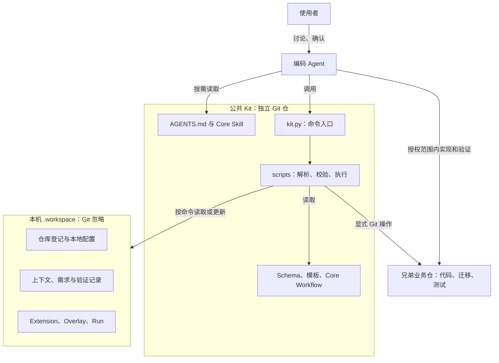
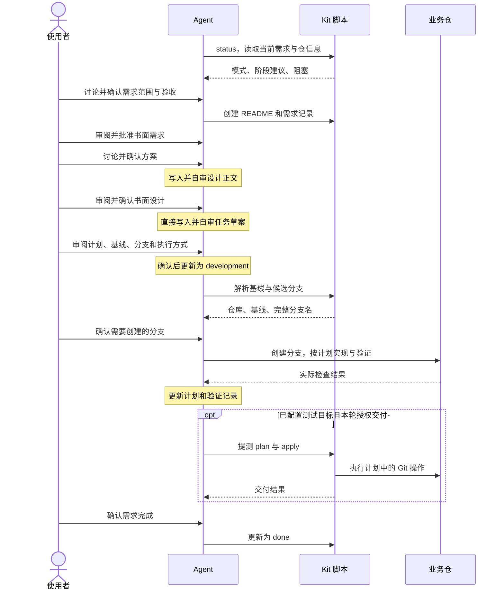
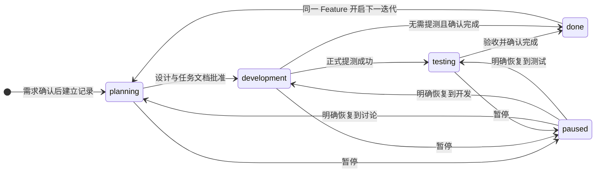
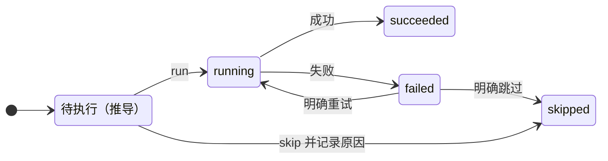
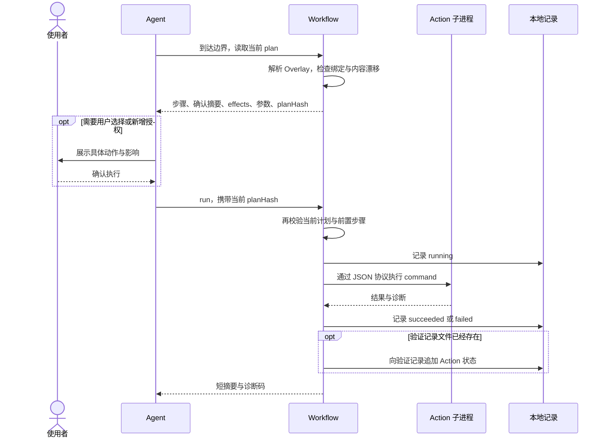

# agent-workbench 架构

本文供人理解和维护 agent-workbench，不属于 Agent 的日常读取清单，不承担执行规则。现有需求开发、验证和续接流程不加载本文；只有用户明确要求阅读或修改时，Agent 才读取。操作步骤见[开始使用](getting-started.md)，执行约定以[根 AGENTS.md](../AGENTS.md)和对应 Core Skill 为准。

## 1. 定位与整体组成

agent-workbench 将多仓开发需要的规则、上下文、需求记录和可执行检查组织在一起。人决定目标与关键取舍，Agent 按阶段讨论和执行，Python 脚本负责可确定的解析、校验和文件操作。业务代码仍在各自独立的 Git 仓中。

箭头表示使用关系，不表示每个命令都会写文件。`status`、`brief` 提供只读结果；`apply`、提测等命令具有各自的写入或 Git 行为。Agent 还会在阶段确认后直接编辑需求和设计正文，验证后记录实际结果。

这三个存储边界解决不同问题：公共 Kit 可以独立更新；`.workspace/` 保留本机上下文和工作进度；业务仓独立维护代码与交付历史。Kit 的父目录只是多个仓的共同位置，不是业务代码 monorepo。

| 场景 | 判定与记录位置 |
| --- | --- |
| 使用者治理业务仓 | 存在 `.workspace/workspace.json`；需求保存在 `.workspace/docs/features/`。 |
| 未初始化或维护公共 Kit | 不存在该文件；尚无维护需求时，status 提示初始化。明确维护 Kit 时，私有记录使用被忽略的 `docs/development/features/`，不随公共仓发布。 |

## 2. 组件各自负责什么

### 协作与命令入口

**Agent 和 Core Skill** 负责把用户目标转成阶段讨论、实施和验证动作。Skill 是按需读取的 runbook；讨论是否充分、结论是否得到用户确认，需要 Agent 遵守协作约定。脚本不会解释整段对话并证明用户已同意。需求与书面设计由[需求设计 Skill](../.agents/skills/workspace-feature-design/SKILL.md)在生成确认后记录；设计获批后，[计划 Skill](../.agents/skills/workspace-writing-plan/SKILL.md)直接生成可执行任务草案，再由使用者批准实际文件和执行条件。

**CLI 入口** [kit.py](../scripts/kit.py)只把子命令转发到对应脚本的 `main()`，不另存状态或重写业务逻辑。直接运行脚本与通过统一入口调用使用同一实现。[kit_describe.py](../scripts/kit_describe.py)提供命令与 runbook 的可读清单；它用于发现能力，不是另一个流程调度器。

### 核心组件与入口

下表按职责分组；每组可能包含命令模块和共享实现，不代表后台服务。

| 组件与代码入口 | 谁使用、依赖什么 | 输入、输出与状态归属 |
| --- | --- | --- |
| 初始化：[workspace_setup.py](../scripts/workspace_setup.py) | 初始化 Skill；依赖输入模型、模板及实际仓库状态。 | 输入登记配置，输出 plan、preview 和生成文件；apply 写 `.workspace/`，clone 单独处理业务仓。 |
| 仓库登记：[workspace_registry.py](../scripts/workspace_registry.py) | 需求设计、跨仓分析和交付流程；依赖已登记仓与分支策略。 | 名称或别名解析成仓库路径和有效策略；branch 返回候选分支，命名 Provider 可替换结果，不在这里创建 Git 分支。 |
| 上下文路由：[workspace_context.py](../scripts/workspace_context.py) | 需要按业务术语定位目标的调用方；依赖 `context.termRouter` 或绑定 Provider。 | 输入文本，输出唯一匹配的仓、capability 或 Action 路由；不匹配或歧义时报告阻塞，不据此自动执行 Action。 |
| 需求记录：[feature_context.py](../scripts/feature_context.py) | 需求设计、续接和提测；依赖模式、仓登记及本地 owner。 | 创建需求 README 和需求正文，列出元数据、修改状态或活跃指针；设计、计划和验证文件由后续阶段产生。 |
| 阶段与摘要：[workspace_status.py](../scripts/workspace_status.py)、[kit_feature_brief.py](../scripts/kit_feature_brief.py) | Agent 新任务与续接；依赖需求元数据、计划、任务证据和仓库登记。 | 输出原始/可信进度、当前任务、执行决策与阻塞；按任务展开时返回工作区、仓库和就近规范入口，不内联规范正文。 |
| 验证与诊断：[workspace-verify](../.agents/skills/workspace-verify/SKILL.md)、[workspace_verification.py](../scripts/workspace_verification.py)、[workspace_doctor.py](../scripts/workspace_doctor.py) | Agent 执行已授权验证；脚本核对任务证据、最终批次和代码指纹。 | 新计划以精简任务证据解锁依赖，最终批次仍绑定完整代码状态；doctor 返回结构诊断，不执行计划命令。 |
| Extension 管理：[workspace_extension.py](../scripts/workspace_extension.py) | Extension Skill；依赖 manifest、来源内容、配置和 Adapter。 | 安装、预览和激活本地扩展，维护 `.workspace/extensions/`、lock、绑定和生成的 `local-*` Adapter。 |
| Provider 调用：[workspace_provider.py](../scripts/workspace_provider.py) | Core 中已定义的能力调用点；依赖当前作用域的唯一绑定与已锁定内容。 | 解析 Provider，校验漂移，以约定协议返回结果；Provider 本身的影响由其实现与声明决定。 |
| Workflow 与 Action：[workflow_model.py](../scripts/workflow_model.py)、[workspace_workflow.py](../scripts/workspace_workflow.py) | Workflow Skill；依赖 Core Stage、Overlay、已激活 Action。 | 解析自定义步骤顺序，生成当前边界的计划，执行或记录 Action；Overlay 与 Run 保存在 `.workspace/`。 |
| 测试交付：[workspace_submit.py](../scripts/workspace_submit.py) | 提测 Skill；依赖明确仓、分支、文件清单与 `testTarget`。 | plan 展示整批 Git 操作，apply 校验计划后执行；正式提测成功才将需求更新为 `testing`。 |
| 公共更新与迁移：[workspace_update.py](../scripts/workspace_update.py)、[workspace_migrate.py](../scripts/workspace_migrate.py) | 更新 Skill 或明确的迁移操作；依赖版本、升级清单和本地状态。 | 公共更新预检后只接受快进；状态迁移另走 preview、备份与 apply，不由公共更新静默覆盖本地记录。 |

### 共享实现为什么存在

- [workspace_model.py](../scripts/workspace_model.py)集中定义登记模型、分支策略、上下文生成和文件写入辅助；[workspace_paths.py](../scripts/workspace_paths.py)集中解析 `.workspace/` 路径，[workspace_local.py](../scripts/workspace_local.py)处理本机配置。多个命令复用这些实现，避免各自解释目录或策略。
- [extension_model.py](../scripts/extension_model.py)和 [extension_registry.py](../scripts/extension_registry.py)负责 Extension 契约与发现；[workspace_adapters.py](../scripts/workspace_adapters.py)处理客户端适配。公开 Core Skill 是源，适配链接与生成的本地 Adapter 不应成为第二套手工规则。
- [provider_protocol.py](../scripts/provider_protocol.py)提供子进程 JSON 输入输出、时间与输出限制、环境变量控制和诊断处理。有 command 的 Action 也复用这套执行协议，复用协议不等于 Action 成了 Core Provider。
- [schemas/](../schemas/)约束配置形状，Python 实现继续检查跨字段关系、路径和运行现场。Schema 通过不等于目标仓、绑定或授权都有效。

## 3. 一个需求如何推进

以下以修改 `service` 仓中的支付重试逻辑为例。流程先确认目标场景和验收标准，再确定复用方案；设计获批后直接形成实施任务。泳道中的“确认”是人的决定；脚本只处理被调用的具体操作。

图中的需求创建命令针对用户治理模式；公共 Kit 维护在对应私有目录记录。图省略了各阶段失败和返工的重复往返：讨论结论需要调整时继续讨论；实现中发现范围、验收或关键方案变化时回到对应阶段；检查失败时保留证据、修复并重新验证。轻量改动使用已有局部路径，不要求创建整套需求文件。

Core Workflow 的公共锚点定义在 [feature-development.json](../workflows/feature-development.json)：

| 顺序 | Core Stage | 承载的工作 |
| --- | --- | --- |
| 1 | `feature.context` | 读取约定与上下文，定位当前需求。 |
| 2 | `feature.classify` | 判断轻量或标准路径。 |
| 3 | `feature.analyze` | 按需分析跨仓职责与契约，可选。 |
| 4 | `feature.design` | 需求与设计先确认生成并审阅；设计获批后直接生成任务草案，再批准实际计划和执行条件。 |
| 5 | `feature.prepare-branch` | 核对现场、基线、分支及相应确认。 |
| 6 | `feature.implement` | 由 `workspace-execute-plan` 按已确认计划实现、任务级验证和自审。 |
| 7 | `feature.verify` | 运行已授权检查并记录证据。 |
| 8 | `feature.submit-test` | 向配置测试目标交付，可选。 |
| 9 | `feature.complete` | 核对验收并确认结束。 |

Stage 提供相对顺序和扩展插入点。它们并不包含一套自动执行所有讨论、编码和交付步骤的程序。`status` 返回的是适合续接的阶段建议，未必逐一显示所有锚点；具体操作仍由 Agent 根据当前 Core Skill 完成。实施阶段的一次一个可验证任务不是会话边界，Agent 有下一项依赖满足的未完成任务时直接继续；只有全部任务完成或所有剩余任务真实阻塞时，才能结束当前请求。宿主强制中断仍通过计划复选框、实际 diff 和验证证据恢复。详细协作步骤见[第一个需求](guides/first-feature.md)。

## 4. 状态、失败与续接

### 需求状态：这个需求处于什么阶段

需求 README 保存 `planning`、`development`、`testing`、`done` 或 `paused`。下面表示约定的主要生命周期，不是 `set-status` 强制执行的转换白名单。

暂停记录不包含自动恢复到上一个状态的历史指针，恢复位置需要明确选择。测试中补丁可以保持 `testing`；验证失败本身也不会自动改写需求状态。`done` 只表示当前迭代结束，不删除代码、分支或记录；同一业务能力变化时保留 slug，归档上一轮后恢复到 `planning`。

### 阶段建议：现在应该做什么

[workspace_status.py](../scripts/workspace_status.py)中的 `_single_feature_progress` 按下列顺序计算建议，[brief](../scripts/kit_feature_brief.py)复用同一判断并传入当前模式：

| 当前记录 | 阶段建议 |
| --- | --- |
| `paused` | 暂停推进，明确恢复或改选需求。 |
| `planning` | 继续 `feature.design`；依据设计是否存在、计划是否有任务，提示讨论方案、计划或确认进入实现。 |
| 计划任务数为零 | 返回设计阶段，补齐可执行任务文档。 |
| 尚有未完成任务 | 继续 `feature.implement`。 |
| 任务完成，但最新验证未通过 | 继续 `feature.verify`。 |
| 任务完成且验证通过，当前为维护模式或需求已是 `testing` | 建议 `feature.complete`。 |
| 其余开发中需求 | 建议 `feature.submit-test`；实际执行仍由提测流程检查目标与授权。 |

实施阶段使用 `brief <slug> --execution --json`，返回按计划位置排序的 `readyTasks`、`confirmationRequired` 和 `executionDecision`。`currentTask` 是默认候选，`readyTasks` 表示依赖满足，仍需 Agent 核对环境和授权；局部外部阻塞时可以顺序推进其他独立候选，调整顺序不等于并行。`RUN` 表示仍有计划任务可推进，`BLOCKED` 表示阶段门禁或依赖无可执行项，`COMPLETE` 表示计划任务已完成。字段不授予外部操作权限。

验证通过的机器判断读取最新的 `## 验证批次`，要求总体结果、审查结论、代码状态和至少一项检查完整；全部退出状态必须为 `0`，且记录的仓库状态与当前 Git 状态完全匹配。旧 `执行记录`、占位文件、最新失败、不完整或过期批次都不能用更早成功覆盖。这个判断不证明测试覆盖全部验收标准，证据的真实性与充分性仍需核对。

多需求并行时，当前会话可以明确指定需求；用户治理模式还可用本机 `activeFeature` 指针帮助新会话选择。没有唯一选择时，status 报告阻塞。显式指定 slug 的 brief 可以返回目标需求摘要，但仍保留工作区级阻塞供调用方判断，不会静默清除其他需求。

没有 `testTarget` 时，阶段建议不代表已经具备交付条件：提测命令会停止并报告目标缺失，由使用者明确后续处理。配置检查、验证通过、正式提测和业务验收是不同事实。

### Action 状态：某一次扩展步骤发生了什么

Run 中按自定义 Stage 保存 `running`、`succeeded`、`failed` 或 `skipped`，并带 fingerprint、更新时间和短摘要。图展示命令型 Action 的主要路径；“待执行”是计划解析的结果，不是新增的持久化状态。

Skill-only Action 由 Agent 执行后直接用 `finish` 记录 `succeeded` 或 `failed`，不经过 Runner 的 `running` 写入。命令执行中断后可能遗留 `running`；使用者可明确重试，或用 `skip` 记录跳过原因。

相同 fingerprint 已成功或明确跳过时，plan 默认不再列出该步骤；失败或遗留 `running` 会提示阻塞，等待明确续接。Extension 内容或 Action 参数等输入改变时，旧 fingerprint 不代表新内容已完成，需要重新生成当前计划。Run 主要保存每个 Stage 的当前记录，不是完整执行日志或业务事务回滚系统。

## 5. 扩展如何接入

### Provider 与 Action 的选择

| 机制 | 用于什么 | 谁触发 |
| --- | --- | --- |
| Provider | 替换 Core 已主动调用的一项能力。当前只有 `branch.naming` 与 `context.term-router`，以 [core_capabilities.py](../scripts/core_capabilities.py)为准。 | 仓库命名、上下文路由等 Core 调用点。 |
| Action | 插入团队自定义工作，例如集成测试、部署或通知。Action 名称不需要预先加入公共 capability 列表。 | Agent 到达 Core 边界后，经 Workflow plan 发现并按授权执行。 |

Provider 在当前作用域只能有一个有效绑定；仓级覆盖优先于默认绑定。没有绑定时，Core 使用自己的实现。已绑定 Provider 不可用或内容漂移时，需要处理阻塞，不应把失败掩盖成另一套结果。

Action 由本地 Overlay 声明 `before` 或 `after` 锚点、`uses`、`trigger` 与非敏感 `with` 参数。[workflow_model.py](../scripts/workflow_model.py)把 Overlay 插入 Core 顺序，检查未知引用、重复 ID 与循环。同一锚点下保留稳定顺序；可选 Core Stage 跳过主体，不会自动删除挂在其边界的自定义步骤。

### 从激活到执行

安装只准备本地副本；激活通过 preview/apply 校验并锁定 Extension 内容；Overlay 的 preview/apply 再确定步骤位置。三者不会互相代替，也不因激活就自动运行 Action。下面以已激活的命令型集成测试 Action 为例：

没有 command 的 Action 由 Agent 读取当前 plan 指向的 Skill，执行后使用 `finish` 记录结果。用户选择不执行时用 `skip` 记录原因。验证文件尚不存在时，Runner 不代建占位文档；扩展自身的产物位置和重跑方式由其 Skill 说明。

`previewHash`、`planHash` 和 fingerprint 用于识别正在审阅、执行或续接的内容是否变化，不是用户同意的凭证。`manual` 需要明确执行或跳过；`auto` 表示自动发现可执行步骤，新增副作用仍须遵守当前授权。`effects` 是预期影响声明，不是操作系统沙箱。协议限制不能代替对本地扩展代码的审阅，详见[安全策略](../SECURITY.md)。

未启用 Overlay 时，不创建 Workflow Run，也不加载 Action Skill。操作方法与示例分别见[本地 Extension](guides/local-extensions.md)和[自定义工作流](guides/custom-workflows.md)。

## 6. 文件归属与修改入口

### 谁保存和更新文件

| 文件类别 | 归属与写入方 | 更新边界 |
| --- | --- | --- |
| Core Skill、脚本、Schema、模板和公开文档 | 公共 Kit Git；由 Kit 维护者修改。 | 公共更新按已确认目标快进，不更新业务仓代码。本文在此类中，但不进入 Agent 日常读取清单。 |
| `workspace.json`、`workspace.local.json` | `.workspace/`；登记、配置或相关管理命令写入。 | 共享登记与本机偏好分别存放；都属于本地状态，不随公共 Git 同步。 |
| 工作区 AGENTS、CONTEXT 与仓 profile | 初始化或登记流程生成；CONTEXT 保存业务事实，AGENTS 保存约定。 | 公共模板更新不会自动重写已有生成文件；相应 preview/apply 只更新其声明的范围。 |
| 需求、设计、计划与验证 | 当前 feature；需求和设计在生成确认后记录，设计获批后直接生成计划草案，验证保存任务检查点和最终批次。 | 新计划默认 `task-evidence-v2`：机器证据位于 `testing/evidence/`，`testing/verification.md` 是 ≤200 行摘要；`task-evidence-v1` 继续只读兼容。 |
| Extension、lock、Overlay 与 Run | `.workspace/`；扩展与 Workflow 命令管理。 | 修改后需要重新检查漂移和计划；详细日志与业务产物由扩展按授权保存。 |
| `local-*` Adapter | 本地激活流程生成，Git 忽略。 | 不手工维护，不作为公共更新覆盖的内容。 |
| 需求附属 SQL、临时 fixture 等 | feature 的 `artifacts/`，SQL 使用 `artifacts/sql/`。 | 只保存与本需求绑定的交付物；扩展产物不预设统一专用目录。 |
| 运行时代码、正式迁移、测试必需 fixture | 对应独立业务仓。 | 随该业务仓版本化，与 Kit 和本机需求记录分开维护。 |

v2 索引同时保存每个任务的最后观察记录与最新可信记录，当前可信判断始终使用最后观察记录，防止旧成功覆盖新失败。命令、代码状态和产物描述复用内容地址；历史归档保留原文与哈希，`verify history` 按 cursor 查询。`verify migrate`、`verify compact` 默认只读预览，apply 在备份后发布并比较前后可信进度、验证结论、阻塞和诊断；中断标记存在时状态查询停止，下一次 apply 校验备份后恢复。Workflow Action 的事件留在 `.workspace/runs`，摘要只显示最新状态。

完整目录、备份和模板更新说明见[本地工作区布局](reference/local-workspace-layout.md)。被 Git 忽略只决定版本控制行为，不提供备份或凭据保护。

### 两个常见维护场景

**调整需求确认方式**：先看[根约定](../AGENTS.md)和[需求设计 Skill](../.agents/skills/workspace-feature-design/SKILL.md)，明确改变的是协作语义、文件生成时机还是阶段判断。生成时机对应 `feature_context.py`，阶段与续接对应 `workspace_status.py` 和 `kit_feature_brief.py`。已有验证入口包括 [test_feature_context.py](../tests/test_feature_context.py)、[test_workspace_status.py](../tests/test_workspace_status.py)、[test_kit_feature_brief.py](../tests/test_kit_feature_brief.py)及 [test_surface.py](../tests/test_surface.py)。脚本测试可以检查产物和状态；讨论质量仍需通过实际对话场景核对。

**接入团队集成测试**：先判断它是额外操作，使用 Action，并在本地 Overlay 中选择合适边界，例如 `feature.implement` 之后。通常只需要团队 Extension 与本地配置，不需要增加公共 capability 或修改 Core Stage。扩展来源和写入目标由使用者明确指定；可参考 [examples/extensions/](../examples/extensions/)。若修改公共解析或执行行为，已有验证入口为 [test_workflow_model.py](../tests/test_workflow_model.py)、[test_workspace_workflow.py](../tests/test_workspace_workflow.py)和 [test_provider_protocol.py](../tests/test_provider_protocol.py)。

其他修改先沿组件表找到实际入口，再查看对应测试；完整公共检查见[贡献指南](../CONTRIBUTING.md)。本文的作用是帮助人定位与理解，新增图示不会为业务需求增加执行步骤。
