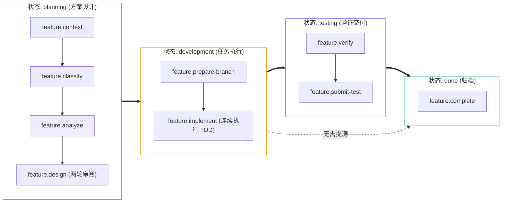

# 核心工作流

`agent-workbench` 将公共文件和本机 `.workspace/` 状态分开。公共 Git 可快进更新；使用者状态和业务仓均不被公共更新覆盖。

## 识别模式

```bash
python3 scripts/kit.py status --root . --json
```

| 条件 | 模式 | 需求位置 |
| --- | --- | --- |
| 不存在 `.workspace/workspace.json` | 未初始化或公共 Kit 维护 | 初始化前没有用户需求目录；公共 Kit 维护记录位于 `docs/development/features/` 且不会进入公开发布树 |
| 存在 `.workspace/workspace.json` | 用户工作区治理 | `.workspace/docs/features/` |

不要把根目录的 `workspace.json`、`CONTEXT.md` 或 `docs/features/` 当作运行时状态。当前状态版本为 1；将来版本升级使用 `workspace_migrate.py` 的 preview/apply 流程，现行 v1 没有需要执行的迁移步骤。

## 初始化与登记

首次初始化完整步骤见[开始使用](../getting-started.md)。新增兄弟仓使用 `workspace-init` 的 add-repo 流程：plan、确认 clone 清单、clone、preview、apply。业务仓没有远端或 `testTarget` 时，相关操作停止并报告缺少信息。

初始化的统一入口顺序为 `kit.py setup init plan --config`、`init clone --config`、`init preview --config`、`init apply --config --preview-hash`；每次 apply 使用同一次 preview 返回的 hash。

## 需求阶段



稳定阶段依次为：`feature.context`、`feature.classify`、`feature.analyze`、`feature.design`、`feature.prepare-branch`、`feature.implement`、`feature.verify`、`feature.submit-test`、`feature.complete`。

需求状态是 `planning`、`development`、`testing`、`done` 或 `paused`，不等同于 Stage。轻量改动不创建需求目录；标准需求先确认需求、生成并审阅书面设计，再由 `workspace-writing-plan` 生成并审阅书面计划。`feature.design` 承载设计与计划的两轮讨论，避免增加新的公共 Stage 锚点。书面计划、基线、分支和执行方式确认并更新为 `development` 后，范围内实现与离线验证持续执行。详情见[第一个需求](../guides/first-feature.md)。

## 验证与结束

`workspace-verify` 只运行仓内声明且本轮已授权的验证，并记录实际证据。`workspace-submit-test` 需要明确的 `testTarget`；没有目标时不会猜测。确认结束后用 `set-status <slug> done` 记录完成，Kit 不自动删除分支或需求记录。

## Core Skill

| Skill | 用途 |
| --- | --- |
| [`workspace-init`](../../.agents/skills/workspace-init/SKILL.md) | 初始化或登记兄弟仓。 |
| [`workspace-repo-onboarding`](../../.agents/skills/workspace-repo-onboarding/SKILL.md) | 读取业务仓规范。 |
| [`workspace-cross-repo-analysis`](../../.agents/skills/workspace-cross-repo-analysis/SKILL.md) | 分析跨仓所有权和顺序。 |
| [`workspace-feature-design`](../../.agents/skills/workspace-feature-design/SKILL.md) | 编写或审查标准需求。 |
| [`workspace-writing-plan`](../../.agents/skills/workspace-writing-plan/SKILL.md) | 把已确认设计拆成可执行计划。 |
| [`workspace-execute-plan`](../../.agents/skills/workspace-execute-plan/SKILL.md) | 逐项执行已确认计划并复核实际 diff。 |
| [`workspace-api-contract`](../../.agents/skills/workspace-api-contract/SKILL.md) | 记录接口契约变化。 |
| [`workspace-feature-workflow`](../../.agents/skills/workspace-feature-workflow/SKILL.md) | 调度已确认的本地 Action。 |
| [`workspace-verify`](../../.agents/skills/workspace-verify/SKILL.md) | 运行并记录验证。 |
| [`workspace-sync-base`](../../.agents/skills/workspace-sync-base/SKILL.md) | 同步已确认基线。 |
| [`workspace-submit-test`](../../.agents/skills/workspace-submit-test/SKILL.md) | 向配置测试目标交付。 |
| [`workspace-extension`](../../.agents/skills/workspace-extension/SKILL.md) | 管理本地 Extension。 |
| [`workspace-update`](../../.agents/skills/workspace-update/SKILL.md) | 计划并应用公共更新。 |

## 等价命令

```bash
python3 scripts/workspace_status.py --root . --json
python3 scripts/workspace_setup.py init plan --config ./workspace-input.json --json
python3 scripts/feature_context.py set-status <slug> done
python3 scripts/workspace_doctor.py --root .
```
