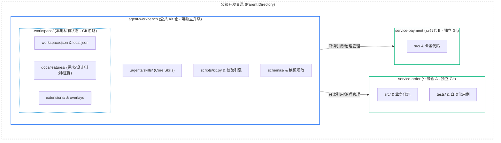

# 开始使用

从 Kit 根目录启动 Agent。业务仓与 Kit 位于同一父目录，但各自是独立 Git 仓；Agent 需要能访问这个父目录。

### 目录与拓扑结构



```bash
git clone https://github.com/sandy-hmb/agent-workbench.git
cd agent-workbench
python3 scripts/kit.py status --root . --json
```

未初始化时 status 会返回 `workspace.init`。初始化只写被忽略的 `.workspace/`，不会修改业务仓内容。

## 建立输入

先生成被忽略的草稿，再填写工作区名称和需要登记的兄弟仓：

```bash
python3 scripts/kit.py setup init draft --output workspace-input.json --json
python3 scripts/kit.py setup init explain --json
```

`workspace-input.json` 是一次性输入，不是工作区事实来源。`remote` 可以为 `null`；这会让后续需要网络 clone 的步骤明确停止，而不是猜测地址。

## 初始化

按下列顺序执行：

```bash
python3 scripts/kit.py setup init plan --config ./workspace-input.json --json
python3 scripts/kit.py setup init clone --config ./workspace-input.json
python3 scripts/kit.py setup init preview --config ./workspace-input.json --json
python3 scripts/kit.py setup init apply --config ./workspace-input.json --preview-hash <previewHash>
python3 scripts/kit.py doctor --root .
```

`plan` 和 `preview` 只读。`clone` 可能访问网络，应先确认 plan 的精确清单；`apply` 使用 preview 返回的 `applyCommand` 和 `previewHash`，只写 `.workspace/`。需要查看完整变更时为 preview 添加 `--diff`。

成功后应有 `.workspace/workspace.json`、`.workspace/workspace.local.json`、`.workspace/AGENTS.md` 和 `.workspace/CONTEXT.md`。它们的编辑边界见[本地工作区布局](reference/local-workspace-layout.md)。

## 接下来

- [第一个需求](guides/first-feature.md)：从轻量改动或标准需求开始，到验证和新会话续接。
- [常用速查表 (Cheat Sheet)](guides/cheat-sheet.md)：一页纸日常高频命令与状态机决策速查。
- [Agent 指令实战 (Prompt Cookbook)](guides/prompt-cookbook.md)：复制即用的 Agent 发号施令与纠偏模板。
- [疑难排查 (Troubleshooting FAQ)](guides/troubleshooting-faq.md)：常见阻塞原因与一键恢复方案。
- **IDE 可视化**：使用 JetBrains IDE 时，可搭配安装 [agent-workbench-intellij](https://github.com/sandy-hmb/agent-workbench-intellij) 插件，直接在编辑器侧边栏管理 Feature 生命周期、审查改动与验证记录。

没有本地 Extension 时无需配置 Extension；没有 `testTarget` 的仓也可以完成实现与离线验证，提测步骤会明确停止。

## 等价命令

不经过 `kit.py` 时，可使用：

```bash
python3 scripts/workspace_status.py --root . --json
python3 scripts/workspace_setup.py init plan --config ./workspace-input.json --json
python3 scripts/workspace_setup.py init clone --config ./workspace-input.json
python3 scripts/workspace_setup.py init preview --config ./workspace-input.json --json
python3 scripts/workspace_setup.py init apply --config ./workspace-input.json --preview-hash <previewHash>
```
