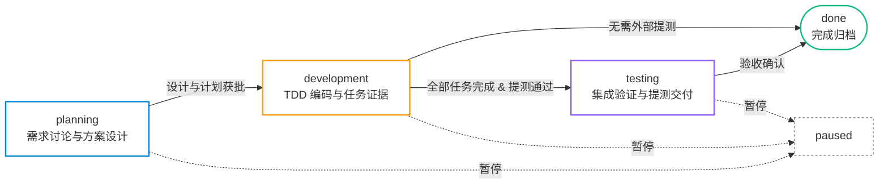

# 常用命令与决策速查 (Cheat Sheet)

本文档提供 `agent-workbench` 日常高频操作、CLI 命令、阶段状态及常见决策的快速参考。

---

## 1. 快速决策树

### 该走“轻量改动”还是“标准需求”？

```text
               准备开始新任务
                     │
         涉及多仓契约变更/新增依赖？
             ├── 是 ──> 走【标准需求流程】(kit.py feature create)
             └── 否
                     │
         涉及数据库结构、状态迁移或破坏性变更？
             ├── 是 ──> 走【标准需求流程】
             └── 否
                     │
         跨会话长线追踪 / 涉及核心业务逻辑？
             ├── 是 ──> 走【标准需求流程】
             └── 否 ──> 走【轻量修改模式】(直接改代码 -> 跑单测 -> 交付)
```

---

## 2. 日常高频命令

所有命令均优先推荐使用统一门面 `python3 scripts/kit.py`。

### 工作区与状态

```bash
# 查看当前工作区状态与下一步行动建议（最常用）
python3 scripts/kit.py status --root . --json

# 健康检查与自检
python3 scripts/kit.py doctor --root .

# 查看当前已登记的仓库与分支策略
python3 scripts/kit.py registry list --json
```

### 需求管理 (Feature)

```bash
# 创建新需求（标准流程）
python3 scripts/kit.py feature create <feature-slug> \
  --repo <repo-name> --title "需求标题" --summary "一句话目标" --json

# 生成规范的分支推荐（不自动创建分支，需人工确认）
python3 scripts/kit.py registry branch <repo-name> \
  --type feature --slug <feature-slug> --json

# 查看需求摘要与当前进展
python3 scripts/kit.py brief <feature-slug> --json

# 展开特定任务的执行上下文（依赖、接口、就近规范指针）
python3 scripts/kit.py brief <feature-slug> --task T01 --json

# 检查当前需求文档的合规性与任务证据链
python3 scripts/kit.py brief <feature-slug> --check --json

# 设置本机当前聚焦的需求（解决 MULTIPLE_ACTIVE_FEATURES 阻塞）
python3 scripts/kit.py feature set-active <feature-slug> --root . --json

# 清除聚焦需求
python3 scripts/kit.py feature set-active --clear --root . --json

# 标记需求已完成（不删除分支或文件）
python3 scripts/kit.py feature set-status <feature-slug> done
```

### 验证与快照 (Verify)

```bash
# 捕获当前 Git 代码状态快照（生成 fingerprint）
python3 scripts/kit.py verify snapshot <repo-name> --json

# 运行已授权的离线验证（测试套件）
python3 -m unittest discover -s tests -p 'test_*.py'
```

### 初始化与接入业务仓 (Setup)

```bash
# 1. 生成初始化草稿
python3 scripts/kit.py setup init draft --output workspace-input.json --json

# 2. 查看初始化计划
python3 scripts/kit.py setup init plan --config ./workspace-input.json --json

# 3. 按计划 clone 远程仓（可选）
python3 scripts/kit.py setup init clone --config ./workspace-input.json

# 4. 预览将写入 .workspace/ 的变更
python3 scripts/kit.py setup init preview --config ./workspace-input.json --json

# 5. 应用初始化（必须带上 preview 返回的 hash）
python3 scripts/kit.py setup init apply --config ./workspace-input.json --preview-hash <previewHash>
```

---

## 3. 需求生命周期与文档门禁



| 状态 (Status) | 对应阶段 (Stage) | 必需文件与门禁要求 |
| :--- | :--- | :--- |
| **`planning`** | `feature.classify`<br>`feature.analyze`<br>`feature.design` | 1. 讨论并收敛需求范围与验收指标。<br>2. 生成 `requirements/requirements.md` (获批)。<br>3. 生成 `design/design.md` (获批)。<br>4. 生成 `plans/implementation.md` (获批)。 |
| **`development`** | `feature.prepare-branch`<br>`feature.implement` | 1. 用户确认并创建分支。<br>2. 逐项执行 T01, T02...，采用 TDD 流程。<br>3. 每次完成任务必须在计划中填写 `task-evidence-v1`。<br>4. 连续推进直到遇到真阻塞或全部任务完成。 |
| **`testing`** | `feature.verify`<br>`feature.submit-test` | 1. 运行目标仓全量验证命令。<br>2. 记录 `testing/verification.md` 包含实际命令与代码快照。<br>3. 如有配置 `testTarget`，执行交付提测。 |
| **`done`** | `feature.complete` | 1. 所有任务标记可信完成。<br>2. 运行 `kit.py feature set-status <slug> done` 归档。 |

---

## 4. 任务执行决策：RUN vs BLOCKED

Agent 读取 `kit brief <slug> --task <id> --json` 后，根据 `executionDecision` 决策：

* **`RUN`（继续执行）**：
  * **含义**：当前任务依赖已全部满足，前置任务证据可信，具备执行条件。
  * **行动**：Agent **禁止向用户请求“是否继续”**，必须自动拉起下一个任务实现与单测。
* **`BLOCKED`（真正阻塞）**：
  * **含义**：存在缺失的前置依赖、未通过的硬门禁、缺少外部授权、或者方案出现未决冲突。
  * **行动**：Agent 立即停止自动推进，向用户清晰陈述：
    1. 阻塞的具体原因；
    2. 期望用户做出的决策或提供的输入；
    3. 待选的恢复选项。
