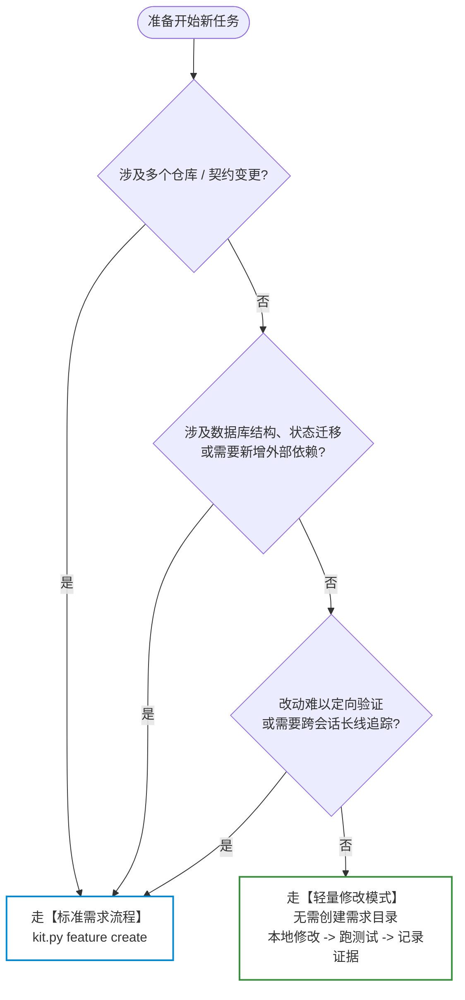

# 第一个需求

每次新会话先读取状态和当前需求摘要：

```bash
python3 scripts/kit.py status --root . --json
python3 scripts/kit.py brief <feature-slug> --json
```

第二条只在你已明确选择某个未完成需求时使用。status 的 `mode` 决定需求目录：用户工作区使用 `.workspace/docs/features/`，维护公共 Kit 才使用 `docs/development/features/`。

## 先分类

在开始编码前，先根据改动特征确定走“轻量路径”还是“标准需求”：



单一业务仓的局部实现、无外部契约或核心状态变化、无需新增依赖且能定向验证时，可以走轻量路径：实现、运行该仓已有验证、在当前交付中记录命令和结果。不创建需求目录。

其他改动走标准需求。以下示例以 `payments-retry` 和已登记仓 `service` 为例：

```bash
python3 scripts/kit.py feature create payments-retry \
  --repo service --title "支付重试" --summary "处理瞬时失败" --json
python3 scripts/kit.py registry branch service \
  --type feature --slug payments-retry --json
```

按命令返回的 `baseBranch` 和 `branch` 写入需求记录；不要手工拼接分支名。创建分支需要工作树干净且用户确认，Kit 不自动创建、切换、提交或合并分支。未明确要求 worktree 时，默认在目标仓当前工作目录开发；分支批准不包含 worktree 操作。创建、删除、切换到或把代码迁移至其他 worktree 前，必须另行展示目录和用途并取得明确确认。

## 标准需求

### 人 - Agent - Kit 协作流程


需求目标、场景、范围、边界、验收和假设收敛后，直接创建草案：

```text
.workspace/docs/features/payments-retry/
├── README.md
└── requirements/requirements.md
```

`requirements/requirements.md` 维护完整的当前目标规格。每个可独立失败的验收点写明角色或条件、触发、可观察结果和必要反例；同一 R 下有多个验收点时使用稳定子编号，不给句子机械编号。Design、Plan 和验证引用具体验收点，不重复正文。

随后按讨论结果按需增加：

- `design/design.md` 维护完整的当前目标设计，明确复用与新增边界、接口和数据流、状态与错误、兼容、关键假设及验证。关键决策使用稳定 D 编号；附件只在有独立读者或维护需要时展开主设计中的决策。
- `workspace-writing-plan` 对全部验收点做 R → D →任务→验证的语义预检。能分别实现、验证和接受的流程拆为不同任务；同一行为的数据组合可以合并。不按技术层、文件数、Case 数或固定分钟数拆分，依赖只表达真实前置条件。
- 执行方式与计划一起批准：默认单 Agent；复杂工作可选择按需子 Agent，或每任务子 Agent 加独立审查。选择子 Agent 不自动并行、创建 worktree、commit 或 push。
- 首次实际验证时创建 `testing/evidence/` 并生成 `testing/verification.md` 摘要；机器真值不依赖摘要正文，不使用占位内容。

首次开发和重大变更逐阶段审阅。范围明确、沿用关键方案且不改变高风险数据、权限语义或外部影响的小迭代，可以一次准备需求差异、必要设计调整和计划，批准整个实际文档包。计划批准后直接开始已授权的执行；相同仓、环境、操作和重试范围不因阶段或 Skill 切换重复确认。

计划获批后由 `workspace-execute-plan` 逐项执行。`currentTask` 是默认候选；普通失败先在当前任务修复。任务确实等待用户决策或外部条件时，记录证据和恢复条件，再顺序推进 `readyTasks` 中其他独立且已授权的工作；调整顺序不等于并行。一次一个可验证任务不是会话边界，只有全部任务完成或所有剩余任务真实阻塞时才能结束。

需要临时 SQL、DDL、DML 或交付 fixture 时，将其放在当前需求的 `artifacts/`，SQL 使用 `artifacts/sql/`。数据模型、迁移顺序、兼容和回退策略默认写在主设计文档的数据库章节；业务正式数据库迁移和自动化测试必需 fixture 必须随业务仓版本化。

### 文档与交接

五份基础文档按阶段产生，不预建空附件；各文档只维护自己的权威内容：

| 阶段 | 文档 | 内容 |
|---|---|---|
| 需求收敛 | README、Requirements | 当前入口与进度；业务行为、验收及必要硬约束 |
| 方案设计 | Design、按需设计附件 | 关键流程、D 决策与理由；复杂接口或数据细节才拆附件 |
| 实施规划 | Plan | 任务结果、依赖、文件、具体步骤和可执行验证 |
| 实现与验证 | 结构化证据、Verification | 实际版本、验证范围与结果、待外部验证事项 |
| 前端交接 | `artifacts/frontend-integration.md` | 页面改动、接口说明、联调注意事项 |
| 提测与部署 | README 交付状态 | 逐仓提交或版本、提测结果、部署情况及外部验收入口 |

Requirements 不写任务进度或实现步骤，但保留影响业务承诺的技术硬约束。Design 按关键流程组织，D 决策就近说明，避免在数据流、概览与决策中完整重述。Plan 保留具体文件、命令和通过条件，不复制设计正文及通用证据格式教程。规划时快照注明日期，长期技术正文不保存当次会话的操作指令。不设文档行数上限，以完整和可独立接手为准。

复杂接口契约使用 `design/api-integration.md`；前端指南使用[三部分模板](../../templates/feature/frontend-integration.md)，两者不强制同时生成。前端需要并行开发时可提前生成同一份“设计稿”；相关实现和本地验证完成后核对实际字段、序列化、包装、错误及页面行为，更新版本并标为“已按实现核对”。部署可用性单独说明，未知写“未确认”。纯说明、示例或环境信息更新不触发设计重审；契约变化仍回写 R/D。

生成或更新文件后登记 README 导航，并运行 `kit.py brief <slug> --check --json`。缺少已有文档入口只警告，失效链接报错；SQL 等成组交付物允许通过目录 README 导航，历史归档与机器证据不逐项登记。检查保持只读，不代替内容核对。测试交接默认写 README，确需独立交付才拆文件；已有 SQL 操作说明直接复用，不另造重复报告。

三类需求的取舍示例：

- 单仓费率配置：主设计加前端指南即可；指南必须保留比例与百分比换算、显式零、来源账户与保存目标差异、单档保存及结果未知处理。
- 小型跨仓历史展示：后端关系放主设计，前端指南只写操作日志识别、字段、必要样例与展示限制。
- 复杂钱包集成：保留接口设计附件、前端指南及 SQL 说明，分别承载事件契约、页面接入和迁移操作，互相引用。

历史 `design/frontend-integration.md` 或作为前端指南使用的 `design/api-integration.md` 保持可读；更新 Kit 不自动重命名、重写或迁移业务 Feature。

## 同一 Feature 的后续迭代

同一业务能力继续使用原 feature slug 和插件条目。当前 Requirements 与 Design 保存最新完整规格，当前 Plan 与 Verification 只保存本轮交付；上一轮结束后再出现实质变更时，将当时文档复制到 `history/iNN/`，从 `history/index.md` 导航，然后把生命周期恢复为 `planning`。当前轮尚未验收时默认继续本轮。

新轮任务可以从 T01 开始，因为证据身份包含 Feature 和 README 中的当前迭代；旧验证只留在归档，不能解锁新任务。启用自定义 Workflow 时使用 `<slug>-iNN` 作为现有 `--run-id`，避免复用旧轮 Action 状态。完整规则由需求设计 Skill 的迭代参考按需加载，日常接手不读取历史正文。

## 验证、续接与完成

完成实现后运行仓登记的验证命令，再运行：

```bash
python3 scripts/kit.py status --root . --json
python3 scripts/kit.py doctor --root .
```

`workspace-verify` 会把已授权的离线验证写成结构化批次：总体结果、审查结论、`kit.py verify snapshot` 取得的代码状态和每项检查的实际结果记录在 `testing/evidence/`，再生成 ≤200 行摘要。旧 v1 记录仍可只读阅读，但只有当前代码状态匹配的完整通过批次可推动后续阶段。无 Extension 时流程没有额外步骤；`testTarget: null` 时不运行提测，保持当前现场并说明目标未配置。

新批次还写入 `verificationScope`（非空字符串，说明实际验证范围）和 `pendingExternalChecks`（当前完整待外部验证清单，每项是非空字符串，无待办写 `[]`）。两字段对旧证据可选，缺失显示“未记录”。写入前核对上一批次与计划，保留未关闭事项；每项说明相关 R、事项、负责方及完成条件，关闭须有证据或明确范围调整。它们不改变本地 `verificationPassed`、`trustedProgress` 判定，外部待办继续由验收跟进。

摘要同时保留最新批次问题、任务失败、文档诊断，并合并 artifacts 与批次 `artifactRefs` 的交付入口；文件存在或被引用不代表已验证或交付。提测、部署事实只在 README 更新，摘要提供入口，不维护第二份发布状态。外部验收不从本地通过、push、PR 或 `testing` 推断；完成确认前核对相关验收事项是否关闭。

日常 `status` 和 `brief` 默认不返回历史正文。使用 `kit.py verify evidence <slug> --task T01 --json` 读取当前证据，或用 `kit.py verify history <slug> --task T01 --json` 分页取得旧记录 ID 后运行 `kit.py verify evidence <slug> --task T01 --id <evidence-id> --json`。旧 Feature 先运行 `verify migrate <slug> --preview`，确认后才执行 `--apply`；`verify compact` 同样默认 preview，不删除证据正文。人类摘要漂移时使用 `kit.py verify render <slug> --preview` 检查，再显式 `--apply` 重建。

新会话通过 `status` 和显式 slug 的 `brief payments-retry --json` 恢复；再用 `brief payments-retry --task T01 --json` 展开当前任务和规范入口。`brief payments-retry --check --json` 检查文档结构、任务证据与本地引用；`progress` 保留勾选数量，`trustedProgress` 决定新计划的执行依赖。需要额外授权的数据库、Provider、部署或联调列为待外部验证，不作为本地顶层任务。验证通过且确认结束后才执行：

```bash
python3 scripts/kit.py feature set-status payments-retry done
```

`done` 只改需求状态，不会删除记录、分支或业务代码。

## 相关参考

- [常用命令速查表 (Cheat Sheet)](cheat-sheet.md)：常用命令、状态机阶段与决策速查
- [Agent 指令实战手册 (Prompt Cookbook)](prompt-cookbook.md)：发起需求、审阅批准、断点续接等黄金提示词
- [疑难排查与常见问题 (Troubleshooting & FAQ)](troubleshooting-faq.md)：多活跃需求阻塞、Hash 不匹配等卡点恢复
- [核心工作流规范](../foundation/README.md)：模式、阶段、分支策略与完成状态的权威定义

## 等价命令

```bash
python3 scripts/feature_context.py create payments-retry \
  --repo service --title "支付重试" --summary "处理瞬时失败" --json
python3 scripts/workspace_registry.py branch service \
  --type feature --slug payments-retry --json
python3 scripts/feature_context.py set-status payments-retry done
```
