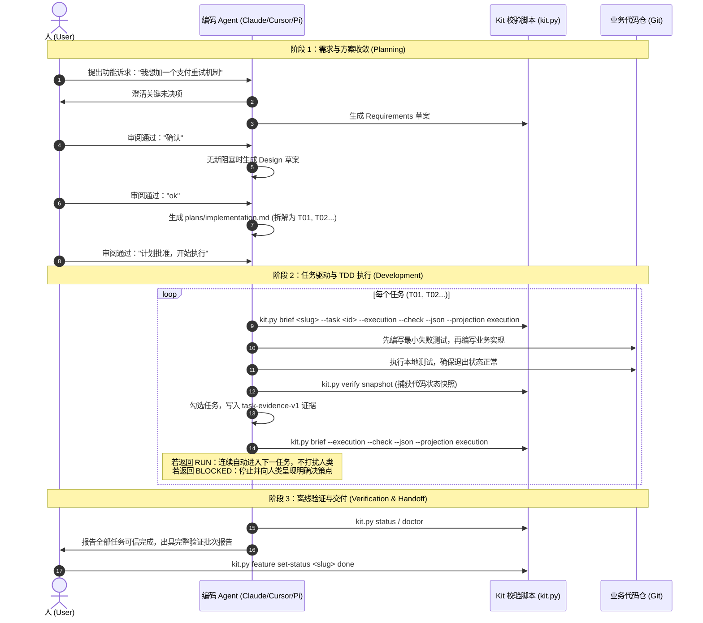

# 第一个需求

每次新会话先读取状态和当前需求摘要：

```bash
python3 scripts/kit.py status --root . --json
python3 scripts/kit.py brief <feature-slug> --json
```

第二条只在你已明确选择某个未完成需求时使用。status 的 `mode` 决定需求目录：用户工作区使用 `.workspace/docs/features/`，维护公共 Kit 才使用 `docs/development/features/`。

## 先分类

在开始编码前，先根据改动特征确定走“轻量路径”还是“标准需求”：


单一业务仓的局部实现、无外部契约或核心状态变化、无需新增依赖且能定向验证时，可以走轻量路径：实现、运行该仓已有验证、在当前交付中记录命令和结果。不创建需求目录。

其他改动走标准需求。以下示例以 `payments-retry` 和已登记仓 `service` 为例：

```bash
python3 scripts/kit.py feature create payments-retry \
  --repo service --title "支付重试" --summary "处理瞬时失败" --json
python3 scripts/kit.py registry branch service \
  --type feature --slug payments-retry --json
```

按命令返回的 `baseBranch` 和 `branch` 写入需求记录；不要手工拼接分支名。创建分支需要工作树干净且用户确认，Kit 不自动创建、切换、提交或合并分支。未明确要求 worktree 时，默认在目标仓当前工作目录开发；分支批准不包含 worktree 操作。创建、删除、切换到或把代码迁移至其他 worktree 前，必须另行展示目录和用途并取得明确确认。

## 标准需求

### 人 - Agent - Kit 协作流程



需求目标、场景、范围、边界、验收和假设收敛后，直接创建草案：

```text
.workspace/docs/features/payments-retry/
├── README.md
└── requirements/requirements.md
```

`requirements/requirements.md` 先用一句话说明目标，再记录做什么、为什么和如何验收。只保留当前需求需要的范围、用户场景、可观察行为与验收、边界情况、关键实体、非目标、假设和来源，不写实现步骤或技术方案，不生成空章节或占位内容。可独立验收行为使用稳定 R 编号；Design、Plan 和验证引用它，不重复整段正文。写入并自审后将 README 的需求审阅更新为“待审阅”，先由使用者批准实际需求文件，再讨论设计。

随后按讨论结果按需增加：

- `design/design.md` 开头集中说明目标、选定方案和关键约束，再记录完整怎么做。存在真实技术取舍时比较二至三个可行方案并说明推荐理由；随后按需展开组件和数据流、数据/API/状态概览、错误处理、兼容、回退与验证，只为需要稳定引用的关键决策分配 D01-DNN。主设计保留完整方案、共享约束、风险和附件导航；只有独立读者、审阅或维护需要时，经确认拆 `design/data-model.md` 或 `design/api-integration.md`。附件扩展主设计，不替代主设计，并声明所扩展的 D 编号和链接回主设计。写入后检查占位内容、内部矛盾、范围、歧义和需求覆盖，再完成结构与 Markdown 阅读自审，由使用者批准整个 Design 审阅包。新建、删除或实质修改任一附件时，设计审阅和已有计划审阅都回到“待审阅”。
- 书面设计获批后，`workspace-writing-plan` 直接创建并自审 `plans/implementation.md` 草案，不重复确认计划摘要。新计划声明 `task-evidence-v1`；每项使用顶层 `- [ ] T01`，并记录交付结果、R/D 依据、唯一目标仓、验证性质、完整 Files 与稳定符号、Interfaces、依赖、具体失败场景、单动作步骤和具体验证。跨仓交付拆为不同任务；持久化任务不能只靠编译或纯 Mock。计划不复制或绑定项目规范。使用者审阅实际计划、基线、分支和执行方式并明确批准后，更新 README 的计划审阅和状态为 `development`。
- 首次实际验证时创建 `testing/verification.md`；它只记录实际命令、退出状态、覆盖验收和执行情况，不使用占位内容。

Requirements 和 Design 只询问会实质改变结果的问题，每轮最多三个；原生交互可用时提供推荐、备选和自定义输入，否则一次提出一个文字问题并等待回复。结论收敛后直接生成草案并请使用者审阅；只有一个明确审阅对象时，“确认”“ok”“可以”“好的”“批准”等简短肯定回复均可批准。获批后在没有新阻塞时同一轮进入下一阶段；计划批准后直接开始已授权的本地执行，除非使用者明确要求只审阅或暂不执行。行为变化先写最小失败测试；配置、文档或已有结构检查覆盖充分的改动采用最小有效验证。实现期间把计划项逐项勾选。

计划获批后由 `workspace-execute-plan` 逐项执行：使用 `brief <slug> --task <id> --execution --check --json --projection execution` 展开当前任务，再按 `instructionContext.rules` 的 kit → workspace → repository → scoped 单调收窄顺序读取规则，事实轴按需用 `status --context-sources` 定位；首次编辑目标仓前完成，同会话复用未变化内容。完成任务验证后记录执行数、跳过数、退出状态、交付核对和代码快照，再勾选任务并用精简投影判断是否解锁依赖。一次一个可验证任务不是会话边界；有下一项依赖满足的未完成任务时直接继续。只有全部任务完成或所有剩余任务真实阻塞时才能结束；新计划的“完成”还要求全部任务可信。

需要临时 SQL、DDL、DML 或交付 fixture 时，将其放在当前需求的 `artifacts/`，SQL 使用 `artifacts/sql/`。数据模型、迁移顺序、兼容和回退策略默认写在主设计文档的数据库章节；业务正式数据库迁移和自动化测试必需 fixture 必须随业务仓版本化。

## 验证、续接与完成

完成实现后运行仓登记的验证命令，再运行：

```bash
python3 scripts/kit.py status --root . --json
python3 scripts/kit.py doctor --root .
```

`workspace-verify` 会把已授权的离线验证写成完整批次：总体结果、审查结论、`kit.py verify snapshot` 取得的代码状态和每项检查的实际结果都记录在 `testing/verification.md`。旧记录仍可阅读，但只有当前代码状态匹配的完整通过批次可推动后续阶段。无 Extension 时流程没有额外步骤；`testTarget: null` 时不运行提测，保持当前现场并说明目标未配置。

新会话通过 `status` 和显式 slug 的 `brief payments-retry --json` 恢复；再用 `brief payments-retry --task T01 --json` 展开当前任务和规范入口。`brief payments-retry --check --json` 检查文档结构、任务证据与本地引用；`progress` 保留勾选数量，`trustedProgress` 决定新计划的执行依赖。需要额外授权的数据库、Provider、部署或联调列为待外部验证，不作为本地顶层任务。验证通过且确认结束后才执行：

```bash
python3 scripts/kit.py feature set-status payments-retry done
```

`done` 只改需求状态，不会删除记录、分支或业务代码。

## 相关参考

- [常用命令速查表 (Cheat Sheet)](cheat-sheet.md)：常用命令、状态机阶段与决策速查
- [Agent 指令实战手册 (Prompt Cookbook)](prompt-cookbook.md)：发起需求、审阅批准、断点续接等黄金提示词
- [疑难排查与常见问题 (Troubleshooting & FAQ)](troubleshooting-faq.md)：多活跃需求阻塞、Hash 不匹配等卡点恢复
- [核心工作流规范](../foundation/README.md)：模式、阶段、分支策略与完成状态的权威定义

## 等价命令

```bash
python3 scripts/feature_context.py create payments-retry \
  --repo service --title "支付重试" --summary "处理瞬时失败" --json
python3 scripts/workspace_registry.py branch service \
  --type feature --slug payments-retry --json
python3 scripts/feature_context.py set-status payments-retry done
```
