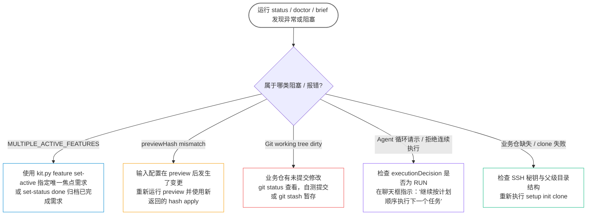

# 常见问题与疑难排查 (Troubleshooting & FAQ)

本文档汇总了使用 `agent-workbench` 过程中最常见的阻塞现象、原因分析及一键恢复方案。



---

## 1. 常见阻塞状态排查

### Q1: 运行 status 提示 `MULTIPLE_ACTIVE_FEATURES` 阻塞

* **现象**：
  ```json
  "blockers": ["MULTIPLE_ACTIVE_FEATURES"],
  "reason": "存在多个未完成需求，选定唯一需求后继续：feat-a, feat-b"
  ```
* **原因**：工作区中存在多个未归档（非 `done`）的需求，Agent 无法猜测当前会话应聚焦哪一个。
* **解决办法**：
  使用 `feature set-active` 指定当前机器当前会话关注的需求：
  ```bash
  python3 scripts/kit.py feature set-active feat-a --root . --json
  ```
  设置后，该信息保存在本地 `.workspace/workspace.local.json`，不会影响其他需求的状态，`blockers` 随即解除。若所有需求均已完成，使用 `python3 scripts/kit.py feature set-status <slug> done` 归档。

---

### Q2: 初始化或登记时报错 `previewHash mismatch`

* **现象**：执行 `init apply` 时提示 Hash 不匹配，拒绝写入。
* **原因**：`apply` 命令要求强绑定前一步 `preview` 命令生成的确定性哈希，以防在人工审阅后输入配置发生隐式漂移。如果在 preview 后修改了 `workspace-input.json`，原 Hash 即失效。
* **解决办法**：
  重新运行一次 preview，并使用其最新返回的 `previewHash`：
  ```bash
  # 重新预览获取 hash
  python3 scripts/kit.py setup init preview --config ./workspace-input.json --json | grep previewHash
  
  # 使用最新 hash 执行应用
  python3 scripts/kit.py setup init apply --config ./workspace-input.json --preview-hash <最新Hash>
  ```

---

### Q3: 分支创建失败，提示工作区不干净 (Git working tree dirty)

* **现象**：Agent 试图为需求创建新分支时被拦截。
* **原因**：目标业务仓或 Kit 仓内存在未提交的修改或未暂存文件。为防止开发过程中代码相互污染，分支创建只允许在干净的工作区执行。
* **解决办法**：
  1. 进入对应仓库，运行 `git status`；
  2. 提交当前修改，或者使用 `git stash` 暂存现场；
  3. 确保工作区为 clean 状态后，重新允许 Agent 创建或检出分支。

---

### Q4: Agent 在每个小任务完成后反复询问“是否继续下一个任务”

* **现象**：明明计划中还有好几个任务，Agent 做完一步就要用户回复一次“继续”，流程极其拖沓。
* **原因**：Agent 的 Instruction 遵从度偏弱，或者它未主动检查任务上下文的 `executionDecision`。
* **解决办法**：
  在对话中直接发送一次强约束指令：
  ```text
  请严格遵循 AGENTS.md 规范：每次完成任务并记录证据后，请检查下一个任务的 brief。
  只要 executionDecision 为 RUN，禁止向我发出任何询问，必须连续、自主地执行下一个任务，直到所有任务完成或遇到真实阻碍（BLOCKED）。请现在立即继续！
  ```

---

### Q5: 为什么 Agent 找不到/访问不到业务仓？

* **现象**：跨仓分析或代码读取时，Agent 提示找不到兄弟仓路径。
* **原因**：
  1. Kit 仓与业务仓并列放在同一个父目录下（Sibling Repositories），不是 Monorepo；
  2. 某些 Agent 客户端（如限制了沙箱工作区的宿主）默认只授权读取当前工作目录（Kit 目录）。
* **解决办法**：
  1. 在宿主配置中，将父目录（包含 Kit 和业务仓的公共目录）添加到工作区或文件白名单；
  2. 或者从**父目录**启动 Agent，并在初次对话时明确指定：“请先读取 `agent-workbench/AGENTS.md`”。

---

## 2. 状态检查与紧急自愈

遇到任何未知状态异常或怀疑环境不一致时，建议按顺序运行以下两行命令：

```bash
# 1. 运行自检工具，诊断文件完整性、版本与 schema 契约
python3 scripts/kit.py doctor --root .

# 2. 获取当前状态全景与下一个行动建议
python3 scripts/kit.py status --root . --json
```

若需完全重置本地运行时状态（注意：会清除未提交的需求草稿与本地记录，请先备份）：
```bash
# 备份本地状态
cp -r .workspace .workspace.bak

# 之后可重新走 setup init 流程
```
